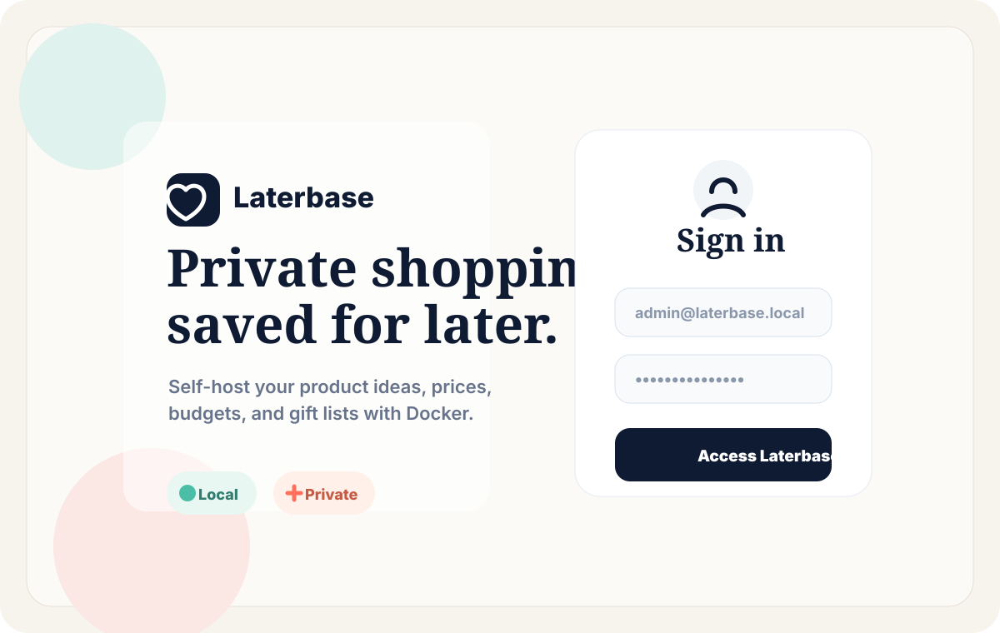
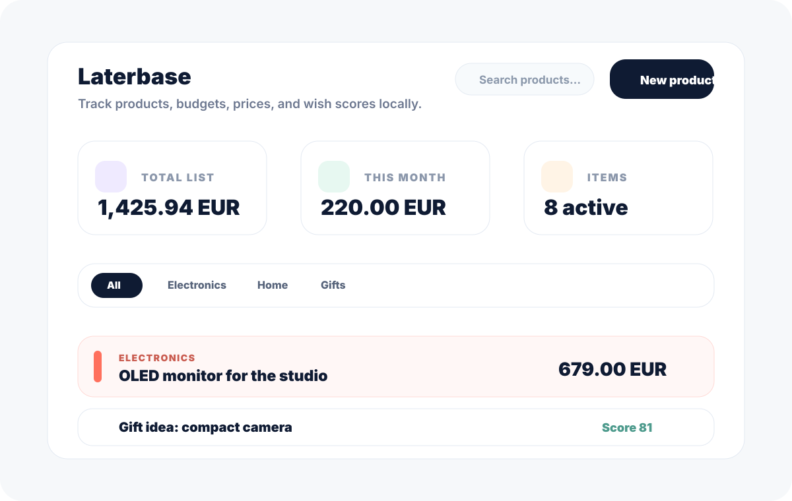
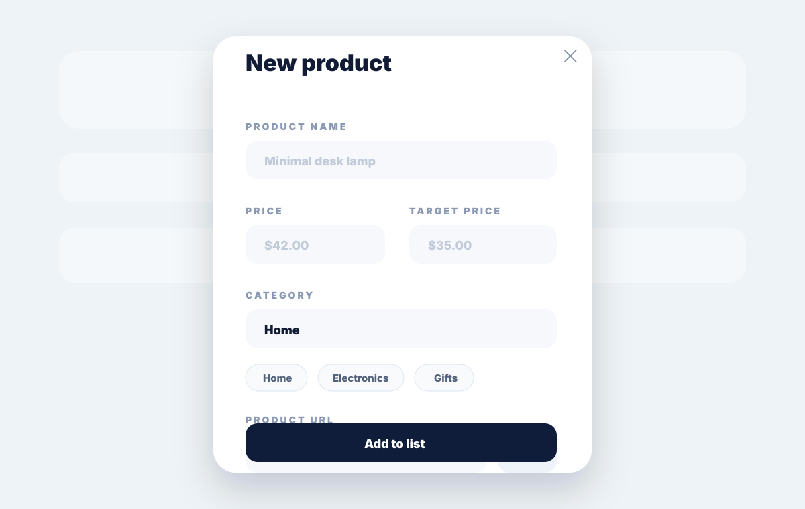
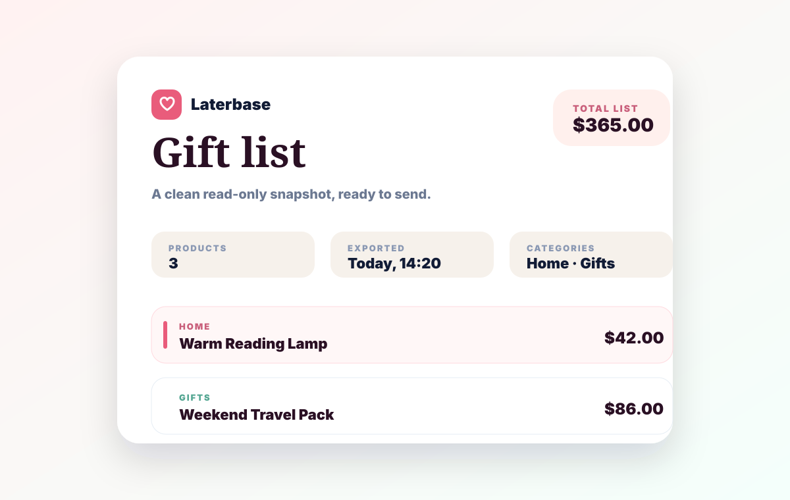

# Laterbase


A private, self-hosted product and shopping tracker for Docker.

Laterbase helps you track products, prices, budgets, purchases, gift ideas, archives, and shareable exports without a hosted database, analytics, telemetry, or a required cloud account.


[Security](SECURITY.md) | [Privacy](PRIVACY.md) | [Contributing](CONTRIBUTING.md) | [Code of Conduct](CODE_OF_CONDUCT.md) | [Changelog](CHANGELOG.md) | [License](LICENSE)

---

## Screenshots

| Private login | Active dashboard |
| --- | --- |
|  |  |

| Add a product | Export a shareable snapshot |
| --- | --- |
|  |  |

## What is Laterbase?

Laterbase is a small self-hosted web app for people who want a private place to manage shopping ideas, target prices, budgets, and purchases.

You run it on your own machine, NAS, VPS, home server, or Docker Desktop on Windows. Data stays in your Docker volume. The app serves a private browser interface protected by a local login.

Laterbase is designed for one private installation, not for a public marketplace, cloud service, or social network.

## What You Can Do

- Track products with current price, target price, notes, priority, and category.
- Organize active wishes, purchased items, and archived items.
- Mark gift ideas and create clean gift-list exports.
- View budget and list insights.
- Paste a product URL and let Laterbase try to read title, price, image, and category.
- Import products from a public Amazon wishlist link, then review them before saving.
- Refresh product prices when supported by the source website.
- Export a polished PNG image or printable PDF snapshot.
- Use a multilingual interface with locale-aware currency formatting.
- Back up and restore your data from the local Docker volume.

## Built With

| Layer | Technology |
| --- | --- |
| Frontend | React 19, Vite, Tailwind CSS |
| UI and icons | Lucide React, custom responsive components |
| Drag and drop | `@dnd-kit` |
| Backend | Node.js 22 HTTP server |
| Storage | Local JSON files in `/data` |
| Authentication | Local account, `scrypt` password hashing, hashed sessions |
| Runtime | Docker and Docker Compose |
| Privacy posture | No telemetry, no analytics, no hosted database |

## Highlights

- **Self-hosted by default**: run it with Docker on Windows, macOS, Linux, a NAS, or a small server.
- **Local JSON storage**: no external database required.
- **Private login**: first-run admin account, password hashing, and session cookies.
- **No telemetry**: no analytics, no tracking pixel, no remote font or script CDN.
- **Best-effort product autofill**: paste a product URL and Laterbase tries to read public metadata.
- **Amazon wishlist import**: paste a public shared wishlist link and review products, prices, links, and image URLs before saving.
- **Static sharing**: export PNG or PDF snapshots instead of exposing your local server.
- **Privacy controls**: external product images are disabled by default.
- **International UI**: includes Italian, English, German, Spanish, French, Hungarian, Dutch, Portuguese, Czech, Polish, Japanese, Chinese, Arabic, Indonesian, Korean, and more.

## Quick Start

This is the recommended installation path for most people.

Before you start, make sure you have:

- Docker Desktop installed and running;
- Git installed;
- PowerShell, Terminal, or another command line open.

You do not need Node.js, npm, or any database to run Laterbase with Docker.

### 1. Clone the repository

Open PowerShell in the folder where you want to download Laterbase, then run:

```powershell
git clone https://github.com/TheRealSirius/Laterbase.git
cd Laterbase
```

### 2. Start Laterbase with Docker Compose

```powershell
docker compose up -d --build
```

The first start can take a few minutes because Docker has to download Node.js and build the app.

### 3. Open the app

Open your browser and go to:

```text
http://localhost:8080
```

### 4. Log in

By default, Laterbase creates the first account with:

```text
Email: admin@laterbase.local
```

If you did not set an admin password, Laterbase generates one during the first start. Read it with:

```powershell
docker logs laterbase
```

Look for:

```text
Generated password: ...
```

Use that password for the first login, then change it from the Account screen.

If you do not see a generated password, the account probably already exists. In that case, use the password you set earlier or restore/reset your Docker volume.

### 5. Stop Laterbase

To stop the app:

```powershell
docker compose down
```

Your data stays in the Docker volume named `laterbase_data`.

To start it again later:

```powershell
docker compose up -d
```

## Choose Your First Password

If you want to set the first password yourself, create a `.env` file next to `docker-compose.yml`:

```env
ADMIN_EMAIL=admin@laterbase.local
ADMIN_PASSWORD=correct-horse-local-47
```

Then start the app:

```powershell
docker compose up -d --build
```

`ADMIN_PASSWORD` must be 15 to 256 characters long and cannot be an obvious password such as `password123456`, `adminlaterbase`, `qwerty`, or one based on your email. Laterbase does not require symbols, numbers, or uppercase letters; a long passphrase is usually better.

These variables are only used when no account exists yet. After the first account is created, change email and password inside Laterbase.

If Laterbase was already started once, editing `.env` will not change the existing account. Change the password inside the app instead.

## Docker Run

Docker Compose is easier, but you can also run the locally built image directly:

```powershell
docker build -t laterbase-selfhosted:local .
docker run -d --name laterbase -p 8080:8080 -v laterbase_data:/data -e ADMIN_EMAIL=admin@laterbase.local --restart unless-stopped laterbase-selfhosted:local
```

Open:

```text
http://localhost:8080
```

To read the generated password:

```powershell
docker logs laterbase
```

## Docker Hub

Laterbase is published on Docker Hub as:

```text
therealsirius/laterbase:latest
therealsirius/laterbase:1.0.0
```

To run the published image:

```powershell
docker run -d --name laterbase -p 8080:8080 -v laterbase_data:/data -e ADMIN_EMAIL=admin@laterbase.local --restart unless-stopped therealsirius/laterbase:latest
```

To pin the first public release:

```powershell
docker run -d --name laterbase -p 8080:8080 -v laterbase_data:/data -e ADMIN_EMAIL=admin@laterbase.local --restart unless-stopped therealsirius/laterbase:1.0.0
```

## Configuration

| Variable | Default | Description |
| --- | --- | --- |
| `PORT` | `8080` | Internal server port used by the container. |
| `LATERBASE_DATA_DIR` | `/data` | Directory where Laterbase stores data files. |
| `ADMIN_EMAIL` | `admin@laterbase.local` | Email for the first local account. Used only when no account exists. |
| `ADMIN_PASSWORD` | Generated automatically | First local password. Must be 15 to 256 characters and not obviously guessable. Used only when no account exists. |
| `LATERBASE_SECURE_COOKIES` | `false` | Set to `true` when serving Laterbase behind HTTPS. |
| `SECURE_COOKIES` | `false` | Alternative name for enabling secure cookies. |

Older `WISHLIST_DATA_DIR` and `WISHLIST_SECURE_COOKIES` variables are still accepted so existing private installs can upgrade safely.

## Data Storage

Laterbase stores data in the container data directory:

```text
/data
```

With Docker Compose, that directory is mapped to the `laterbase_data` Docker volume.

Main files:

```text
/data/laterbase.json
/data/auth.json
/data/sessions.json
```

`laterbase.json` contains products, categories, budget settings, purchases, archive data, gift flags, and dashboard preferences.

If an older private install already has `/data/wishlist.json`, Laterbase migrates it to `/data/laterbase.json` on first start.

`auth.json` contains local account data. Passwords are not stored in plain text; Laterbase stores a `scrypt` hash.

`sessions.json` contains hashed session tokens.

Treat backups as personal data.

## Backup

Open PowerShell in the folder where you want to save the backup, then run:

```powershell
docker run --rm -v laterbase_data:/data -v "${PWD}:/backup" alpine sh -c "tar -czf /backup/laterbase-data-backup.tar.gz -C /data ."
```

This creates:

```text
laterbase-data-backup.tar.gz
```

Store it somewhere private.

## Restore

Put `laterbase-data-backup.tar.gz` in the current PowerShell folder, then run:

```powershell
docker stop laterbase
docker run --rm -v laterbase_data:/data -v "${PWD}:/backup" alpine sh -c "tar -xzf /backup/laterbase-data-backup.tar.gz -C /data"
docker start laterbase
```

Open Laterbase again:

```text
http://localhost:8080
```

## Update

When using a source checkout:

```powershell
git pull
docker compose up -d --build
```

Your `laterbase_data` volume is reused.

## Change Port

If port `8080` is already used, change the host port in `docker-compose.yml`:

```yaml
ports:
  - "9090:8080"
```

Then open:

```text
http://localhost:9090
```

## HTTPS and Reverse Proxy

Laterbase is fine over HTTP on `localhost` or a trusted private network.

If you expose it outside your machine or private network, put it behind HTTPS with a reverse proxy such as Caddy, Traefik, or Nginx Proxy Manager.

Example Caddy route:

```caddyfile
laterbase.example.com {
  reverse_proxy 127.0.0.1:8080
}
```

When serving over HTTPS, enable secure cookies:

```yaml
environment:
  - LATERBASE_SECURE_COOKIES=true
```

Do not expose a private Laterbase instance directly to the public internet without HTTPS and a strong password.

## Privacy Model

Laterbase is built to be quiet.

It does not include:

- analytics;
- advertising scripts;
- tracking pixels;
- remote JavaScript CDNs;
- remote font CDNs;
- any required cloud database or cloud service;
- central accounts controlled by the project maintainer.

External network activity can still happen when you choose to:

- open a product link;
- enable external product images;
- use product autofill;
- use the browser quick-add shortcut on a product page;
- import a public Amazon wishlist link;
- refresh prices from product URLs.

See [PRIVACY.md](PRIVACY.md) for the full privacy model.

## Product Autofill

Laterbase can try to fill product details from a pasted URL.

It looks for public page metadata such as:

- product title;
- price;
- image;
- category hints.

This is best-effort. Many large e-commerce websites block automated requests with bot protection, CAPTCHA, Cloudflare, JavaScript-only rendering, or private APIs.

Laterbase does not bypass those protections, does not use hidden scraping proxies, and does not send product URLs to a third-party extraction service.

If autofill fails, fill the product manually.

## Browser Quick Add

The account screen can generate an "Add to Laterbase" bookmarklet.

Drag it to your browser bookmarks bar. When you are on a product page, click it and Laterbase will try to open a new local tab with:

- product name;
- price;
- product URL;
- product image URL;
- a best-effort category.

The shortcut runs in your browser on the page you already opened. The draft is passed to Laterbase through the URL fragment (`#quickAdd=...`), which is not sent to the web server as an HTTP request and is cleared after the app reads it.

## Amazon Wishlist Import

Laterbase can import from a public Amazon wishlist sharing link, for example a URL that contains:

```text
/hz/wishlist/ls/
```

It tries to read:

- product names;
- prices;
- product links;
- image URLs;
- category hints.

Before saving, Laterbase shows a review screen where you can edit names, prices, and categories, skip duplicates, or deselect products you do not want.

This is best-effort and only supports public Amazon wishlist sharing pages. Print-view pages, private lists, login-only lists, bot-protected responses, and changed Amazon markup may fail.

Imported images are stored as external image URLs. They are displayed only if you enable external images.

You can run the compatibility helper:

```powershell
pwsh -ExecutionPolicy Bypass -File scripts\test-autofill-compat.ps1
```

Results vary by country, network, website rules, and time.

## Read-Only Exports

Laterbase does not expose your local server to friends or create public cloud links.

Instead, it creates static files you can send yourself:

- **Image export** creates a polished PNG that works well in chats and messages.
- **PDF export** opens the browser print dialog so you can save the list as a PDF.
- **Gift mode** creates a softer, shareable layout and can include only items marked as gift ideas.
- **Prices can be hidden** when you want to send a gift list without amounts.

Exported files are snapshots. They do not sync back to your server and do not give anyone access to your local Laterbase instance.

## Security Notes

Laterbase includes practical protections for a small self-hosted app:

- password hashing with `scrypt`;
- password policy based on length and obvious-password blocking, without mandatory symbol rules;
- opaque random session tokens;
- hashed sessions at rest;
- `HttpOnly` session cookie;
- `SameSite=Strict` session cookie;
- optional `Secure` cookie when HTTPS is enabled;
- login rate limiting;
- strict security headers;
- origin checks for unsafe API requests;
- autofill, price refresh, and Amazon import URL validation;
- private network and localhost targets blocked during server-side URL reads to reduce SSRF risk.

No self-hosted app is automatically secure just because it runs in Docker. Keep Docker updated, use HTTPS when exposed outside your own machine, and back up your data.

See [SECURITY.md](SECURITY.md) for reporting security issues.

## Development

Install dependencies:

```powershell
npm install
```

Start the backend:

```powershell
npm run dev:server
```

In a second terminal, start the frontend:

```powershell
npm run dev
```

Open:

```text
http://localhost:5173
```

Build the production frontend:

```powershell
npm run build
```

Run lint:

```powershell
npm run lint
```

Serve the production build with the Node backend:

```powershell
npm run preview
```

## Project Status

Laterbase is ready for public self-hosting.

Current distribution status:

- README screenshots are included.
- Docker Compose setup is documented and supported.
- Security, privacy, contributing, code of conduct, changelog, and license files are included.
- Docker Hub image is published as `therealsirius/laterbase:latest` and `therealsirius/laterbase:1.0.0`.
- GitHub Release `v1.0.0` is published.

## License

Laterbase is licensed under the [GNU Affero General Public License v3.0](LICENSE).
