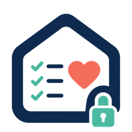

# Wishlist



A private, self-hosted wishlist and shopping tracker for Docker.

Wishlist helps you track products, prices, budgets, purchases, gift ideas, archives, and shareable exports without a hosted database, analytics, telemetry, or a required cloud account.


[Security](SECURITY.md) | [Privacy](PRIVACY.md) | [Contributing](CONTRIBUTING.md) | [Code of Conduct](CODE_OF_CONDUCT.md) | [Changelog](CHANGELOG.md) | [License](LICENSE)

---

## What is Wishlist?

Wishlist is a small self-hosted web app for people who want a private place to manage shopping ideas, target prices, budgets, and purchases.

You run it on your own machine, NAS, VPS, home server, or Docker Desktop on Windows. Data stays in your Docker volume. The app serves a private browser interface protected by a local login.

Wishlist is designed for one private installation, not for a public marketplace, cloud service, or social network.

## What You Can Do

- Track products with current price, target price, notes, priority, and category.
- Organize active wishes, purchased items, and archived items.
- Mark gift ideas and create clean gift-list exports.
- View budget and wishlist insights.
- Paste a product URL and let Wishlist try to read title, price, image, and category.
- Refresh product prices when supported by the source website.
- Export a polished PNG image or printable PDF snapshot.
- Use a multilingual interface with locale-aware currency formatting.
- Back up and restore your data from the local Docker volume.

## Built With

| Layer | Technology |
| --- | --- |
| Frontend | React 19, Vite, Tailwind CSS |
| UI and icons | Lucide React, custom responsive components |
| Drag and drop | `@dnd-kit` |
| Backend | Node.js 22 HTTP server |
| Storage | Local JSON files in `/data` |
| Authentication | Local account, `scrypt` password hashing, hashed sessions |
| Runtime | Docker and Docker Compose |
| Privacy posture | No telemetry, no analytics, no hosted database |

## Highlights

- **Self-hosted by default**: run it with Docker on Windows, macOS, Linux, a NAS, or a small server.
- **Local JSON storage**: no Supabase, Firebase, Postgres, Redis, or external database required.
- **Private login**: first-run admin account, password hashing, and session cookies.
- **No telemetry**: no analytics, no tracking pixel, no remote font or script CDN.
- **Best-effort product autofill**: paste a product URL and Wishlist tries to read public metadata.
- **Static sharing**: export PNG or PDF snapshots instead of exposing your local server.
- **Privacy controls**: external product images are disabled by default.
- **International UI**: includes Italian, English, German, Spanish, French, Hungarian, Dutch, Portuguese, Czech, Polish, Japanese, Chinese, Arabic, Indonesian, Korean, and more.

## Quick Start

The current repository is ready to build locally with Docker Compose.

### 1. Clone the repository

```powershell
git clone https://github.com/TheRealSirius/Wishlist.git
cd Wishlist
```

### 2. Start Wishlist

```powershell
docker compose up -d --build
```

### 3. Open the app

```text
http://localhost:8080
```

### 4. Log in

By default, Wishlist creates the first account with:

```text
Email: admin@wishlist.local
```

If you did not set an admin password, Wishlist generates one during first start. Read it with:

```powershell
docker logs wishlist
```

Look for:

```text
Generated password: ...
```

Use that password for the first login, then change it from the Account screen.

## Choose Your First Password

If you want to set the first password yourself, create a `.env` file next to `docker-compose.yml`:

```env
ADMIN_EMAIL=admin@wishlist.local
ADMIN_PASSWORD=change-me-now-123
```

Then start the app:

```powershell
docker compose up -d --build
```

`ADMIN_PASSWORD` must be at least 12 characters long.

These variables are only used when no account exists yet. After the first account is created, change email and password inside Wishlist.

## Docker Run

You can also run the locally built image directly:

```powershell
docker build -t wishlist-selfhosted:local .
docker run -d --name wishlist -p 8080:8080 -v wishlist_data:/data -e ADMIN_EMAIL=admin@wishlist.local --restart unless-stopped wishlist-selfhosted:local
```

Open:

```text
http://localhost:8080
```

## Docker Hub

A Docker Hub image can be added after the first public release. Until then, the recommended path is building from source with Docker Compose.

When an image is available, the command will look like:

```powershell
docker run -d --name wishlist -p 8080:8080 -v wishlist_data:/data --restart unless-stopped <dockerhub-user>/wishlist:latest
```

## Configuration

| Variable | Default | Description |
| --- | --- | --- |
| `PORT` | `8080` | Internal server port used by the container. |
| `WISHLIST_DATA_DIR` | `/data` | Directory where Wishlist stores data files. |
| `ADMIN_EMAIL` | `admin@wishlist.local` | Email for the first local account. Used only when no account exists. |
| `ADMIN_PASSWORD` | Generated automatically | First local password. Must be at least 12 characters. Used only when no account exists. |
| `WISHLIST_SECURE_COOKIES` | `false` | Set to `true` when serving Wishlist behind HTTPS. |
| `SECURE_COOKIES` | `false` | Alternative name for enabling secure cookies. |

## Data Storage

Wishlist stores data in the container data directory:

```text
/data
```

With Docker Compose, that directory is mapped to the `wishlist_data` Docker volume.

Main files:

```text
/data/wishlist.json
/data/auth.json
/data/sessions.json
```

`wishlist.json` contains products, categories, budget settings, purchases, archive data, gift flags, and dashboard preferences.

`auth.json` contains local account data. Passwords are not stored in plain text; Wishlist stores a `scrypt` hash.

`sessions.json` contains hashed session tokens.

Treat backups as personal data.

## Backup

Open PowerShell in the folder where you want to save the backup, then run:

```powershell
docker run --rm -v wishlist_data:/data -v "${PWD}:/backup" alpine sh -c "tar -czf /backup/wishlist-data-backup.tar.gz -C /data ."
```

This creates:

```text
wishlist-data-backup.tar.gz
```

Store it somewhere private.

## Restore

Put `wishlist-data-backup.tar.gz` in the current PowerShell folder, then run:

```powershell
docker stop wishlist
docker run --rm -v wishlist_data:/data -v "${PWD}:/backup" alpine sh -c "tar -xzf /backup/wishlist-data-backup.tar.gz -C /data"
docker start wishlist
```

Open Wishlist again:

```text
http://localhost:8080
```

## Update

When using a source checkout:

```powershell
git pull
docker compose up -d --build
```

Your `wishlist_data` volume is reused.

## Change Port

If port `8080` is already used, change the host port in `docker-compose.yml`:

```yaml
ports:
  - "9090:8080"
```

Then open:

```text
http://localhost:9090
```

## HTTPS and Reverse Proxy

Wishlist is fine over HTTP on `localhost` or a trusted private network.

If you expose it outside your machine or private network, put it behind HTTPS with a reverse proxy such as Caddy, Traefik, or Nginx Proxy Manager.

Example Caddy route:

```caddyfile
wishlist.example.com {
  reverse_proxy 127.0.0.1:8080
}
```

When serving over HTTPS, enable secure cookies:

```yaml
environment:
  - WISHLIST_SECURE_COOKIES=true
```

Do not expose a private wishlist directly to the public internet without HTTPS and a strong password.

## Privacy Model

Wishlist is built to be quiet.

It does not include:

- analytics;
- advertising scripts;
- tracking pixels;
- remote JavaScript CDNs;
- remote font CDNs;
- Supabase, Firebase, Vercel, or any required cloud service;
- central accounts controlled by the project maintainer.

External network activity can still happen when you choose to:

- open a product link;
- enable external product images;
- use product autofill;
- refresh prices from product URLs.

See [PRIVACY.md](PRIVACY.md) for the full privacy model.

## Product Autofill

Wishlist can try to fill product details from a pasted URL.

It looks for public page metadata such as:

- product title;
- price;
- image;
- category hints.

This is best-effort. Many large e-commerce websites block automated requests with bot protection, CAPTCHA, Cloudflare, JavaScript-only rendering, or private APIs.

Wishlist does not bypass those protections, does not use hidden scraping proxies, and does not send product URLs to a third-party extraction service.

If autofill fails, fill the product manually.

You can run the compatibility helper:

```powershell
pwsh -ExecutionPolicy Bypass -File scripts\test-autofill-compat.ps1
```

Results vary by country, network, website rules, and time.

## Read-Only Exports

Wishlist does not expose your local server to friends or create public cloud links.

Instead, it creates static files you can send yourself:

- **Image export** creates a polished PNG that works well in chats and messages.
- **PDF export** opens the browser print dialog so you can save the list as a PDF.
- **Gift mode** creates a softer, shareable layout and can include only items marked as gift ideas.
- **Prices can be hidden** when you want to send a gift list without amounts.

Exported files are snapshots. They do not sync back to your server and do not give anyone access to your local Wishlist instance.

## Security Notes

Wishlist includes practical protections for a small self-hosted app:

- password hashing with `scrypt`;
- opaque random session tokens;
- hashed sessions at rest;
- `HttpOnly` session cookie;
- `SameSite=Strict` session cookie;
- optional `Secure` cookie when HTTPS is enabled;
- login rate limiting;
- strict security headers;
- origin checks for unsafe API requests;
- autofill URL validation;
- private network and localhost targets blocked during autofill to reduce SSRF risk.

No self-hosted app is automatically secure just because it runs in Docker. Keep Docker updated, use HTTPS when exposed outside your own machine, and back up your data.

See [SECURITY.md](SECURITY.md) for reporting security issues.

## Development

Install dependencies:

```powershell
npm install
```

Start the backend:

```powershell
npm run dev:server
```

In a second terminal, start the frontend:

```powershell
npm run dev
```

Open:

```text
http://localhost:5173
```

Build the production frontend:

```powershell
npm run build
```

Run lint:

```powershell
npm run lint
```

Serve the production build with the Node backend:

```powershell
npm run preview
```

## Project Status

Wishlist is preparing its first public release.

Before publishing a tagged release and Docker Hub image:

- add clean screenshots using demo data;
- decide the final Docker Hub image name;
- publish a tagged Docker image;
- create the first GitHub release.

## License

Wishlist is licensed under the [GNU Affero General Public License v3.0](LICENSE).
